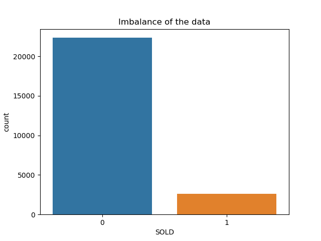
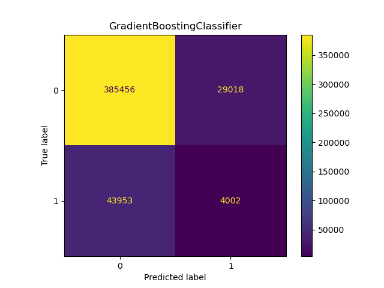
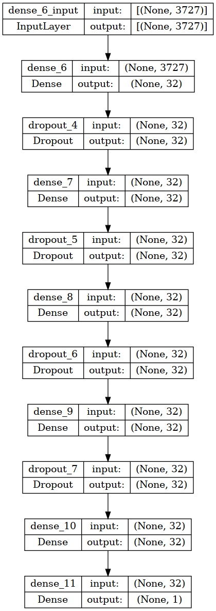
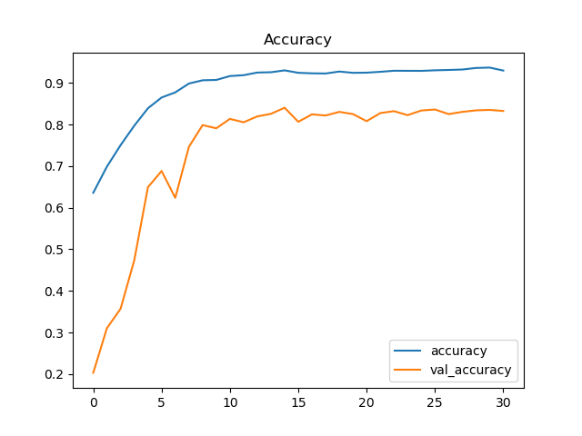
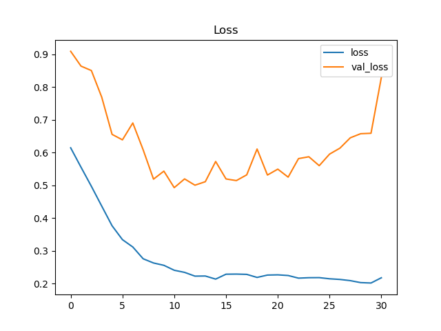

# Predicting long term care insurance on a pre-selected group

**Pratik Bassi**

#### Executive summary
We are able to predict who purchases long term care insurance from a preselected group of flyer respondents.

#### Rationale
A working model would help optimize marketing to customers, reducing the business cost of each sale. This could result in lower premiums for customers and more profits for the companies using this model.

#### Research Question
Is there a pattern that a machine learning model can find in long term care insurance respondents that determines whether or not they will purchase long term care insurance?

#### Data Sources
The data comes from a private company that sends out life insurance flyers to customers. The data contains several dozen fields, and is loaded into an oracle database. The data is heavily imbalanced, with about ten percent of the data being successful sales.

#### Methodology
For this problem, we will be performing a grid search to optimize recall and parameters for our models.

We will do this for both standard machine learning models and for neural networks. Neural networks are expensive from a hardware perspective, so we will likely be constrained on what tests we can run, and will operate with a limited dataset.

 Recall and accuracy are both important metrics, but either is acceptable to optimize for. Optimizing for accuracy will help reduce the number of false positives, and reduce the amount spent marketing to people who will not purchase insurance. Optimizing for recall will make sure that the groups predicted on by these models will be properly mined for potential customers. 

#### Results
Firstly,  a standard machine learning model can improve somewhat on the preselected data. The improvement is moderate, with different combinations of models, parameters, and training sizes being differently effective. Time is also a constraint when training this data set, as some grid searches take a significant amount of time to complete.

This classifier performed the best in the large scale prediction testing, with the best ration of true positives to false positives.

Other models performed strangely without a grid search to improve their parameters, including the random forest classifier.

This highlights the importance of GridSearching for better hyperparameters, inspecting the confusion matrices, and larger scale testing of models when they are created. Without inspecting the actual values in the confusion matrices, I would likely have not realized how conservatively this model was assigning values to the true value.

This is a comparison of the large scale testing results between models.

Secondly, we created a neural network to see if we could improve on the standard machine learning models. We tested a number of permutations and combinations of techniques, but due to hardware limitations we were unable to run a true grid search. The main constraint was memory, with only 16gb being available and being further limited by the nature of Windows Subsystem for Linux and it's shared resource pool with Windows. 

We started by downloading more columns from the original dataset, cleaning the columns, and encoding the data. We then needed to balance the training set, so we used a RandomOverSampler. Moving on, we used StandardScaler to scale the data inside the dataframe. Finally, we created a sequential model with this structure:

With several days of a manual grid search, this model was selected to be optimal to avoid overfitting and maintain a reasonable degree of accuracy. Dropout and some l1l2 regularization proved essential to producing our results.

Our accuracy and loss tended to reach it's optimal point for early stopping around the 7th to 10th epoch. We created a callback to create and save a model based on a checkpoint created at this optimal point. 

Our accuracy was over 80%

Our loss bottomed out at just below 0.500

#### Next steps
My suggestions for next steps would be to apply some of these generated models to a larger, not preselected database of individuals. I think that making predictions on this set would yield interesting results and potentially help reduce the number of mailers needed to be sent out. The neural network should potentially also benefit from a larger amount of memory so that a larger dataset could be trained on. This would likely improve accuracy and recall statistics.

#### Outline of project

- [Link to grid search](exploration.ipynb)
- [Link to neural network](neuralNetwork.ipynb)

##### Contact and Further Information
Please contact [pratikbassi@gmail.com](pratikbassi@gmail.com) for any further discussion.