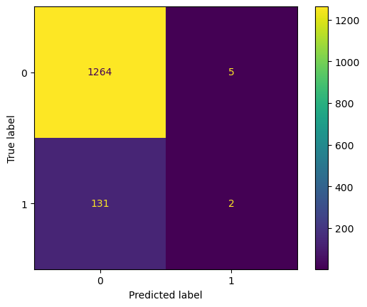
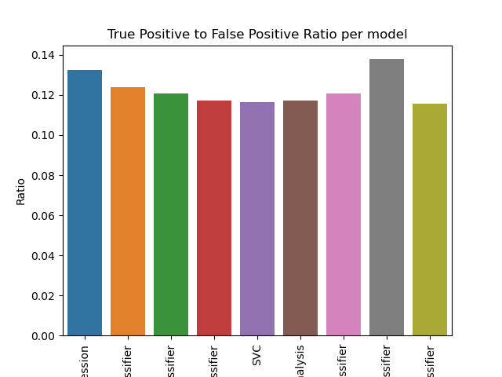

# Predicting long term care insurance on a pre-selected group

**Pratik Bassi**

#### Executive summary
We are able to predict who purchases long term care insurance from a preselected group of flyer respondents.

#### Rationale
A working model would help optimize marketing to customers, reducing the cost of each sale. This could result in lower premiums for customers and more profits for the companies using this model.

#### Research Question
Is there a pattern that a machine learning model can find in long term care life insurance respondents?

#### Data Sources
The data comes from a private company that sends out life insurance flyers to customers. The data contains several dozen fields, and is loaded into an oracle database.

#### Methodology
For this problem, we will be mainly performing a grid search to optimize recall and parameters for our models. Recall is the most important metric here, because traditionally every lead in this data set would have been contacted and marketed to. Every lead that becomes a sale should be a true positive in our confusion matrix. Thus, we must try to match that, while potentially reducing the number of false positives. Any improvement we can make there would be beneficial, as this is a very imbalanced dataset and the traditional recall is very poor.

#### Results
My research found that yes, a model can improve somewhat on the preselected data. The improvement is moderate, with different combinations of models, parameters, and training sizes being differently effective. Time is also a constraint when training this data set, as some grid searches take a significant amount of time to complete.

This classifier performed the best in the large scale prediction testing, with the best ration of true positives to false positives.

Other models performed strangely without a grid search to improve their parameters, including the random forest classifier.

This highlights the importance of GridSearching for better hyperparameters, inspecting the confusion matrices, and larger scale testing of models when they are created. Without inspecting the actual values in the confusion matrices, I would likely have not realized how conservatively this model was assigning values to the true value.

This is a comparison of the large scale testing results between models.

#### Next steps
My suggestions for next steps would be to apply some of these generated models to a larger, not preselected database of individuals. I think that making predictions on this set would yield interesting results and potentially help reduce the number of mailers needed to be sent out.

#### Outline of project

- [Link to grid search](exploration.ipynb)

##### Contact and Further Information